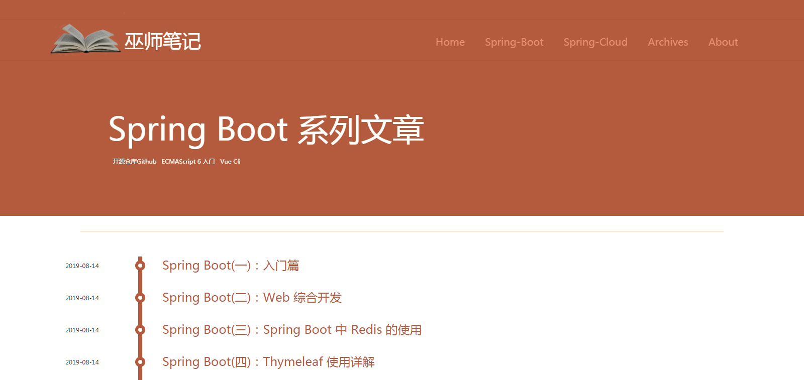
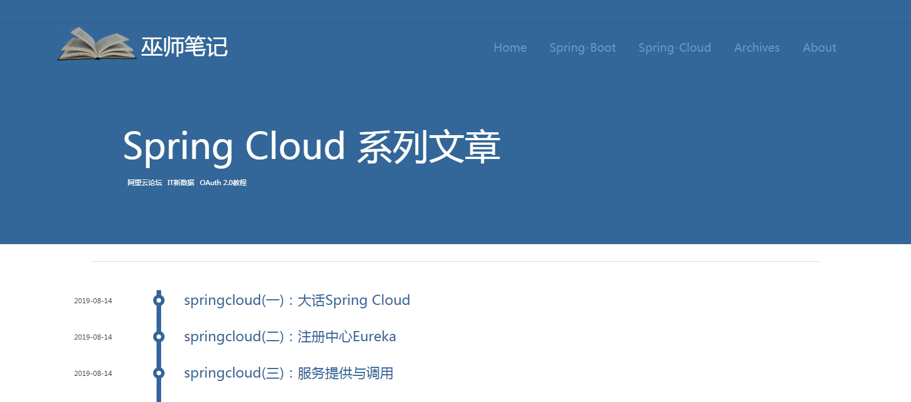
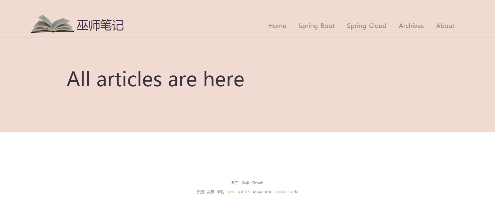
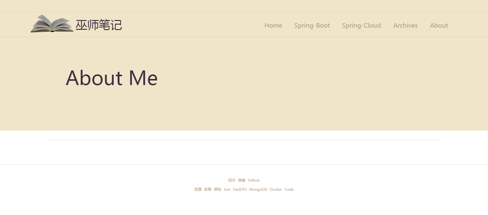
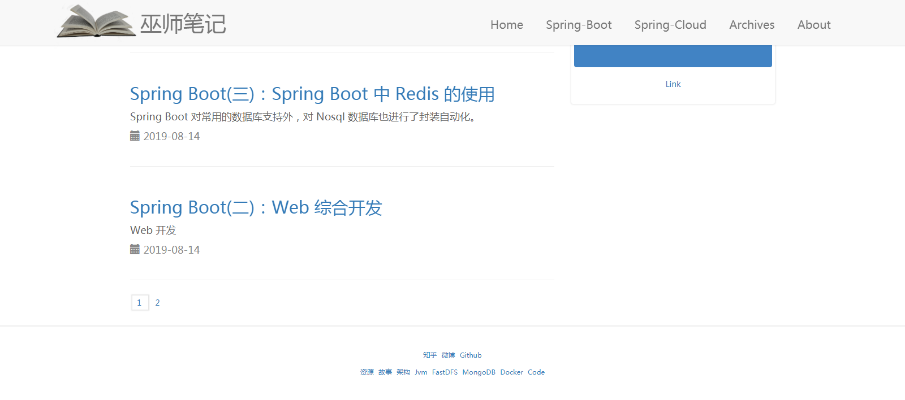
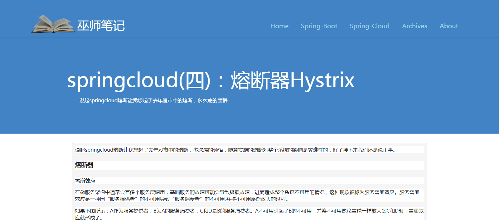

# 巫师笔记

### 类型
> **博客平台**

### 技术栈
> 1. 后端：SpringBoot + thymleaf
> 2. 数据库: mysql
> 3. 服务器: tomcat

### 描述
本项目采用thymleaf基于组件设计，来实现拖放式编程、快速的属性处理以及真正的面向对象的设计。后端用SpringBoot实现，采用观察者模式来实现组件之间的协调，本项目UI设计参考于[纯洁的微笑](http://www.ityouknow.com/)。

### 展示
* 首页：    http://localhost:8080
* 编写博客: http://localhost:8080/writing

### 部署
1. 项目配置
    * [MySQL](https://dev.mysql.com/downloads/mysql/)
    * [JDK1.8或以上](http://www.oracle.com/technetwork/java/javase/overview/index.html)
    * [Maven](https://maven.apache.org/download.cgi)
2. 编辑 application.properties 文件，修改要连接的数据库用户名密码
   ```
   spring.datasource.username=root
   spring.datasource.password=root
   ```
3. 创建数据库
   ```
   create database blog;
   ```
4. 选择使用数据库
   ```
   use blog;
   ```
5. 数据库导入myblog-master/sql下的数据库文件
   * blog.sql
   
### 项目截图








### 联系交流
- EMail: [carl36528@gmail.com](http://carl36528@gmail.com)
- 我的网址: [itmewdata.com](https://itnewdata.com)
