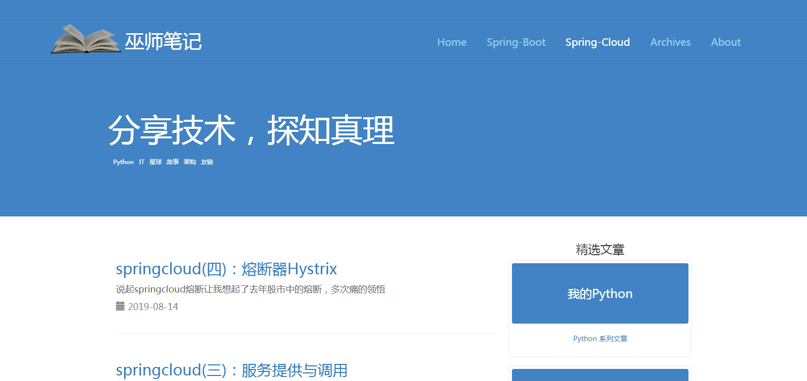

# 巫师笔记

### 类型
> **博客平台**

### 技术栈
> 1. 后端：SpringBoot + thymleaf
> 2. 数据库: mysql
> 3. 服务器: tomcat

### 描述
这是我学习 SpringBoot 的时候做的第一个练手项目，当时经常看[纯洁的微笑](http://www.ityouknow.com/)的博客，非常羡慕，所以参考做了这个博客平台。
这个项目使用thymleaf模板技术， 使用公共组件页面拼接。项目不大，是一个适合初学者学习的项目。

### 展示
* 首页：    http://localhost:8080
* 编写博客: http://localhost:8080/writing

### 部署
1. 项目配置
    * [MySQL](https://dev.mysql.com/downloads/mysql/)
    * [JDK1.8或以上](http://www.oracle.com/technetwork/java/javase/overview/index.html)
    * [Maven](https://maven.apache.org/download.cgi)
2. 编辑 application.properties 文件，修改要连接的数据库用户名密码
   ```
   spring.datasource.username=root
   spring.datasource.password=root
   ```
3. 创建数据库
   ```
   create database blog;
   ```
4. 选择使用数据库
   ```
   use blog;
   ```
5. 数据库导入myblog-master/sql下的数据库文件
   * blog.sql
   
 ### 项目截图
 
